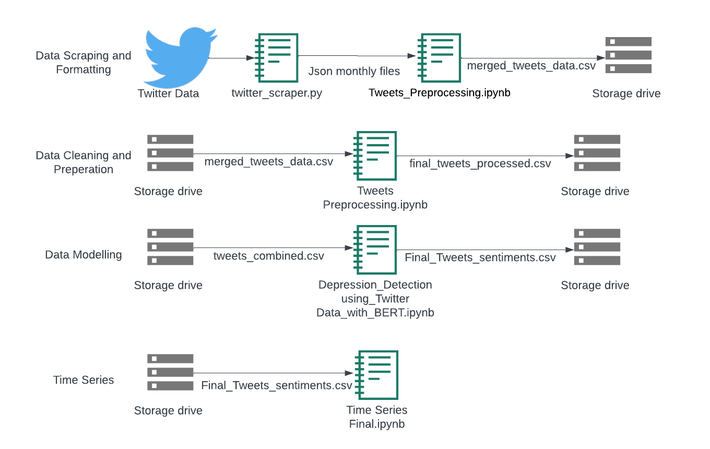

### This project was a requirement to successfully complete the **[CSE 6242: Data and Visual Analytics](https://omscs.gatech.edu/cse-6242-data-visual-analytics)** course as part of the Georgia Tech Computer Science master's program.

# Time-series analysis of geographic depression scores on Twitter using BERT
Bert depression detection model based on Twitter data with time series analysis to provide healthcare organizations with a visibility heatmap of regional mental health trends. Our approach not only predicts depression with high accuracy but also offers additional context, such as regional depression
trends and seasonality analysis, and visualization tools on Tableau to guide healthcare and social workers in addressing the regions most impacted by mental health issues.



## Dashboard
- The final Tableau dashboard can be found: **[Here](https://public.tableau.com/views/DVA_Team013/DVAProject?:language=en-US&publish=yes&:display_count=n&:origin=viz_share_link)**.
## Installation

- Open the notebooks directly in Google Colab, or download the notebooks to run files locally.
- To run files locally:
1. Clone the repository
2. Create a new virtual environment with python 3.8
3. Run the following command from the repository folder:
    ```shell
    pip install -r requirements.txt #install requirements
    ```

## Execution
All the relevant code can be found in **[CODE](CODE)**.

### Data Scraping and Formatting
- The data is obtained by scraping twitter using python code [twitter_scraper.py](CODE/Scraper/twitter_scraper.py), the scraped json files used can be found [here](https://drive.google.com/drive/folders/1WDUZdUZPyZoVOnWSfK79BjPa9gcAz_Wo?usp=sharing).
- The json scraped files are processed and formatted by [Tweets_Preprocessing.ipynb](CODE/Data%20Collection%20and%20Preprocessing/Tweets_Preprocessing.ipynb) to produce [merged_tweets_data.csv](https://drive.google.com/file/d/1HaNdCDpshtBqBXOzBucFu7rzusmUi_rW/view?usp=sharing).

> **_NOTE:_** The code for generating the [merged_tweets_data.csv](https://drive.google.com/file/d/1HaNdCDpshtBqBXOzBucFu7rzusmUi_rW/view?usp=sharing) file has been forcibly prohibitted from running in the pre-processing notebook to prevent accidental re-running, as this process is typically a one-time operation when the dataset is first created. However, if you would like to run this code again, you can comment out the ollowing code line in these cells: **`script false --no-raise-error`**.


### Data Cleaning and Preperation
- The [merged_tweets_data.csv](https://drive.google.com/file/d/1HaNdCDpshtBqBXOzBucFu7rzusmUi_rW/view?usp=sharing) is cleaned and prepared by using [Tweets_Preprocessing.ipynb](CODE/Data%20Collection%20and%20Preprocessing/Tweets_Preprocessing.ipynb) to produce [final_tweets_processed.csv](https://drive.google.com/file/d/1s3fXnHjKivPfSLLARmU_bl7xB6oFKZuI/view?usp=share_link).

### Data Modelling
- The notebook [Depression_Detection_using_Twitter_Data_with_BERT.ipynb](CODE/Data%20Modelling/Depression_Detection_using_Twitter_Data_with_BERT.ipynb) employs the [tweets_combined.csv](https://drive.google.com/file/d/1gzrdgIpHn2bxE2u5BZHFlohC8sNrB6XH/view?usp=share_link) file for training and testing the model. The model generates predictions, and the results are saved in [Final_Tweets_sentiment.csv](https://drive.google.com/file/d/1ZKV3_bLhAYYY42GXaq46CbWPI_RDoeou/view?usp=sharing).

> **_NOTE:_** There are some code cells that are forcibly prohibited from running as explained in the notebooks due to the need for high GPU and Google Maps API. You can check the final result at the end of the notebooks. However, if you would like to run these cells and you have access to "Google Maps API" and GPU; comment out this code line in these cells: **`%%script false --no-raise-error`**.


### Time Series
- The output from the depression detection model [Final_Tweets_sentiment.csv](https://drive.google.com/file/d/1ZKV3_bLhAYYY42GXaq46CbWPI_RDoeou/view?usp=sharing), is ingested into the [Time_Series_Final.ipynb](CODE/Time%20Series/Time_Series_Final.ipynb) for time series analysis.

### Tableau Dashboard
Please review the final story we have created to present the results of our investigation: **[Depression Detection with BERT using Twitter Data](https://public.tableau.com/views/DVA_Team013/DVAProject?:language=en-US&publish=yes&:display_count=n&:origin=viz_share_link)**.

- To create Tableau story that explores 3 interactive dashboards, we connected the cleaned tweet csv and time series csv, which is saved on PC, to Tableau. And published it to Tableau public server. You can also find the origianl Tableau notebook here: **[DVA_Team013.twbx](https://github.gatech.edu/rmennigke3/CSE6242Project/raw/main/CODE/Data%20Visualization/DVA_Team013.twbx)**.
